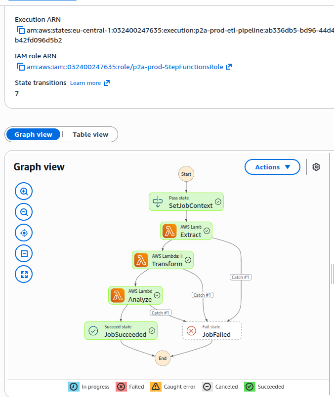
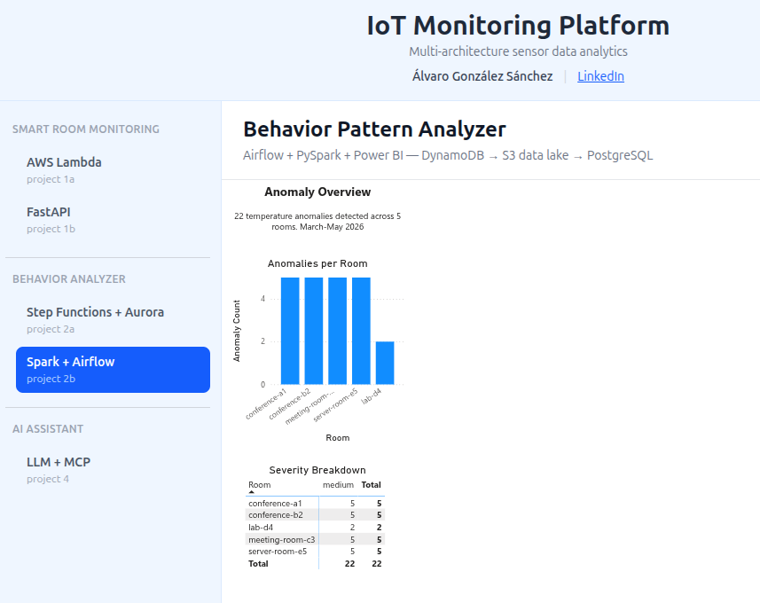
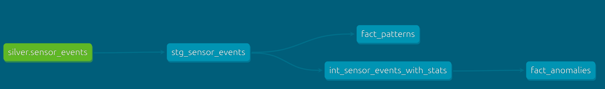

# IoT Monitoring Platform

Portfolio project demonstrating backend engineering skills in an IoT context.

The platform ingests sensor data from conference rooms (temperature, humidity, occupancy, motion), runs anomaly detection, and tracks room state in real time.

**Live demo:** [iot.gonzalezsanchez.dev](https://iot.gonzalezsanchez.dev)
**API docs:** [iot.gonzalezsanchez.dev/docs](https://iot.gonzalezsanchez.dev/docs)
**Developer:** Álvaro González Sánchez — [gonzalezsanchez.dev](https://gonzalezsanchez.dev) | [LinkedIn](https://www.linkedin.com/in/GonzalezSanchez)

---

## Architecture

```
IoT Sensor / API Client
        │
        ▼
 API Gateway (REST)
        │
   ┌────┴────────────────┐
   │                     │
   ▼                     ▼
POST /events          GET /rooms
(ingest_event)        (get_rooms / get_room_detail)
   │                     │
   ▼                     ▼
EventService         RoomRepository
   │
   ├── AnomalyDetector (threshold checks)
   ├── EventRepository (DynamoDB)
   └── RoomRepository  (DynamoDB — state update)

DynamoDB
├── SensorEvents  (room_id + timestamp)
└── RoomStatus    (room_id)
```

---

## Platform Architecture

A real IoT system has three distinct layers. This platform covers all three:

| Layer | Responsibility | Project |
|-------|---------------|---------|
| **Device layer** | How devices authenticate and send data securely | Project 3 |
| **Ingestion layer** | How sensor events are processed and stored | Project 1 / 1b |
| **Analytics layer** | What patterns emerge from the data over time | Project 2a / 2b |

Projects 1 and 2 are each implemented twice — deliberately — to demonstrate that the same business logic can be solved with different infrastructure choices.

### Shared data contract — `prod-SensorEvents`

Projects 1b and 2a share the same DynamoDB table (`prod-SensorEvents`, partition key: `room_id`, sort key: `timestamp`). In this portfolio setup each project writes its own format:

- **Project 1b** writes individual sensor readings: `{ sensor_type, value, unit, status }`
- **Project 2a seed** writes combined readings: `{ payload: { temperature, humidity, motion, occupancy } }`

In a real production system, **Project 3 (IoT Gateway)** would own this contract. All devices authenticate through the gateway, which validates and normalises every event before writing to `prod-SensorEvents`. Projects 1b and 2a would then consume a single, consistent format — no per-project adaptation needed.

---

## Projects

### Project 1 — Smart Room Monitor (AWS Lambda + API Gateway)

Serverless REST API deployed to AWS. Sensor events are ingested via API Gateway,
processed through anomaly detection, and stored in DynamoDB.

**Stack:** Python, AWS Lambda, API Gateway, DynamoDB, CloudFormation, CloudWatch
**Infrastructure:** Provisioned via CloudFormation (tables + IAM — least-privilege)
**CI/CD:** GitHub Actions — tests on every push, deploy to AWS on merge to main
**Tests:** 105 unit tests, 84% coverage (pytest + moto for DynamoDB mocking)
**Auth:** Intentionally excluded — device authentication is covered in Project 3

[View project](backend/project1a-smart-room-monitor/)

---

### Project 1b — Smart Room Monitor (FastAPI + Docker)

Same domain logic as Project 1, re-implemented with FastAPI and deployed as a
containerised application. A deliberate choice to show infrastructure independence.

**Stack:** Python, FastAPI, DynamoDB (AWS), Docker, nginx, OpenTelemetry, Datadog, Cloudflare tunnel
**Live:** [iot.gonzalezsanchez.dev](https://iot.gonzalezsanchez.dev)
**API docs:** [iot.gonzalezsanchez.dev/docs](https://iot.gonzalezsanchez.dev/docs)
**Auth:** Intentionally excluded — device authentication (JWT via Cognito) is covered in Project 3
**Observability:** End-to-end with OpenTelemetry auto-instrumentation → OTel Collector → Datadog APM — see [Observability section](#observability-project-1b) below

[View project](backend/project1b-smart-room-monitor-fastapi/)

---

### Project 2a — Behavior Pattern Analyzer (AWS native)

ETL pipeline that reads historical sensor data from Project 1a (DynamoDB) and detects
behavioral patterns across rooms over time — occupancy schedules, temperature trends,
unusual activity. Scheduled batch processing via EventBridge + Step Functions, results
stored in Aurora Serverless v2 and exposed via REST API.

**Stack:** Python 3.13, AWS Lambda, Step Functions, EventBridge, Aurora Serverless v2, Terraform, Docker
**Infrastructure:** Provisioned via Terraform (VPC, Aurora, IAM, Secrets Manager)
**CI:** GitHub Actions — mypy, ruff, pytest (unit + integration + regression), terraform validate
**Deploy:** On-demand for demos — destroyed after to minimise costs
**Tests:** Unit (mocked AWS), integration (real PostgreSQL via Docker), regression (documented production bugs)
**LinkedIn post:** [Serverless ETL pipeline for behavioral pattern detection](https://www.linkedin.com/posts/activity-7450582273697026049-aOCE)

#### Step Functions execution graph — Extract → Transform → Analyze pipeline



[View project](backend/project2a-behavior-analyzer/) — more screenshots (execution history, dashboard) in the project README

---

### Project 2b — Behavior Pattern Analyzer (Data Engineering stack)

Same analytics goal as Project 2a, re-implemented with a data engineering stack.
A deliberate choice to demonstrate the same problem solved with different tools.

**Stack:** Python, Apache Airflow, PySpark 4.x, AWS S3 (data lake), PostgreSQL (self-hosted), Power BI
**Infrastructure:** Terraform (S3 bucket + IAM)
**CI/CD:** GitHub Actions (CI) + Jenkins (CD) — deployment pipeline with environment promotion (dev → staging → prod)
**Tests:** 94 unit tests, 93% coverage (pytest + PySpark in-process) — pipeline orchestration tested via mocks, I/O boundaries excluded (require live AWS/PostgreSQL)

**Data lake architecture** — three layers:

```
DynamoDB (prod-SensorEvents)
    │
    ▼ extract.py
S3/raw   (s3a://p2b-prod-sensor-events/raw/)       ← Parquet, partitioned by year/month
    │
    ▼ transform.py
S3/processed (s3a://p2b-prod-sensor-events/processed/)  ← validated, cleaned Parquet
    │
    ▼ analyze.py
PostgreSQL (self-hosted on acer-server via Docker)  ← patterns + anomalies → Power BI
```

**Why PostgreSQL only at the end?** Power BI cannot query S3 Parquet directly — it needs a SQL endpoint. Alternatives like Amazon Athena or Redshift add AWS costs. PostgreSQL runs self-hosted via Docker on acer-server, always live, no destroy cycle, no RDS costs (~€15–20/month avoided).

**Pipeline results (first production run, May 2026):** 12,744 events extracted → 12,715 processed → 5 occupancy patterns, 5 temperature trends, 22 anomalies detected.

#### Power BI dashboard — Anomaly Overview (22 temperature anomalies across 5 rooms)



**LinkedIn post:** [Same analytics goal. Completely different stack.](https://www.linkedin.com/posts/gonzalezsanchez_dataengineering-apacheairflow-pyspark-ugcPost-7460192378834890752-nb33)

[View project](backend/project2b-behavior-analyzer/) — more screenshots (temperature trend, patterns summary) in the project README

#### Project 2a vs 2b — same goal, different tools

| | Project 2a | Project 2b |
|---|---|---|
| **Orchestration** | AWS Step Functions | Apache Airflow |
| **Processing** | AWS Lambda (Python) | PySpark |
| **Storage** | Aurora Serverless v2 | S3 data lake + PostgreSQL |
| **Infrastructure** | Terraform (VPC, RDS, IAM) | Terraform (S3, IAM) |
| **CD pipeline** | GitHub Actions | Jenkins |
| **Visualisation** | React dashboard (API) | Power BI (SQL direct) |
| **Cost model** | On-demand, destroy after demo | Always-on, self-hosted |

---

### Project 2c — Behavior Pattern Analyzer (Azure Databricks Lakehouse)

Same analytics domain as Project 2b, rebuilt on a fully managed Azure stack with Databricks,
Delta Lake, and dbt. Demonstrates cloud portability and modern lakehouse architecture.

**Stack:** Python, PySpark, Azure Databricks, Delta Lake, Unity Catalog, dbt-databricks, ADLS Gen2, Terraform, Databricks Asset Bundles (DABs)
**Infrastructure:** Full IaC via Terraform — ADLS Gen2, Databricks workspace (Premium), Access Connector (Managed Identity), Key Vault, Unity Catalog, SQL Warehouse, budget alert
**Pipeline:** Bronze → Silver (WAP pattern, MERGE idempotent) → Gold (dbt incremental models)
**Orchestration:** DABs job with monthly schedule (1st of every month, 06:00 Brussels)
**CI:** GitHub Actions — ruff, mypy, pytest (43 tests, 92% coverage), dbt parse, bundle validate, terraform validate
**Live:** Gold layer data served via FastAPI `/lakehouse/*` endpoints → visible in portfolio dashboard

**Data architecture:**
```
Python script → ADLS Gen2 Bronze (JSON, Hive-partitioned)
    ↓ Auto Loader (cloudFiles + checkpoint)
Delta Lake Bronze  (p2c_dev.bronze.sensor_events)
    ↓ PySpark WAP — validate, MERGE good records, append quarantine
Delta Lake Silver  (p2c_dev.silver.sensor_events + sensor_events_quarantine)
    ↓ dbt-databricks — incremental models, z-score anomaly detection
Delta Lake Gold    (fact_anomalies, fact_patterns, dim_rooms, dim_buildings)
    ↓ FastAPI /lakehouse/* → portfolio dashboard
```

**dbt Gold models:**

| Model | Type | Description |
|---|---|---|
| `fact_anomalies` | incremental | Z-score per room + sensor type, `is_anomaly = \|z\| > 2.5` |
| `fact_patterns` | incremental | Hourly aggregations (avg/min/max/count) |
| `dim_rooms` | table | Room metadata |
| `dim_buildings` | table | Building metadata |

#### dbt lineage — Silver → Staging → Intermediate → Gold



[View project](backend/project2c-lakehouse-dbt/)

---

### Project 3 — IoT Device Gateway Simulator *(planned)*

Secure gateway for device registration, authentication and rate limiting — the layer that
would own the shared `prod-SensorEvents` data contract.
Full spec: [docs/project3-iot-gateway.md](docs/project3-iot-gateway.md)

---

### Project 4 — LLM / MCP Layer *(planned)*

AI layer exposing the FastAPI routes as MCP tools via `fastapi-mcp` — *"Which rooms had
anomalies this week?"* answered by Claude querying the platform directly.
Full spec: [docs/project4-llm-mcp.md](docs/project4-llm-mcp.md)

---

### Frontend — React Dashboard

Real-time dashboard for visualising sensor data and room states.

**Stack:** React, TanStack Query, Vite, nginx
**Live:** [iot.gonzalezsanchez.dev](https://iot.gonzalezsanchez.dev)

---

## Observability (Project 1b)

End-to-end observability implemented with **zero manual instrumentation** — OpenTelemetry auto-instrumentation exports traces, logs and metrics through an OTel Collector into Datadog APM.

**What's instrumented automatically:**
- Distributed traces: every HTTP request becomes a trace with DynamoDB child spans
- Log-trace correlation: every log entry carries a `trace_id` and `span_id`
- Watchdog anomaly detection: Datadog auto-detected and resolved an error rate spike
- Metrics: `http.server.active_requests` submitted via `opentelemetry.instrumentation.fastapi`

### APM Services — Watchdog auto-detected an error rate spike on GET /rooms/{room_id}/events

> Distributed tracing pinpointed the fault to FastAPI (98.1% error rate), not DynamoDB (0% error rate). [LinkedIn post →](https://www.linkedin.com/posts/activity-7455558039853645824-reu9)


More screenshots — service map, flame graphs, log patterns, log-trace correlation — in the [project README](backend/project1b-smart-room-monitor-fastapi/README.md#observability).

**LinkedIn post:** [Zero manual instrumentation — OTel + Datadog on a live FastAPI service](https://www.linkedin.com/posts/activity-7455558039853645824-reu9)

---

## Skills Demonstrated

| Category | Skills | Where |
|-------|-------|-------|
| Python & API design | FastAPI, Pydantic v2, clean architecture (models → services → repositories), REST | 1, 1b, 2a |
| AWS | Lambda, API Gateway, DynamoDB, Step Functions, EventBridge, Aurora Serverless v2, S3 data lake | 1, 1b, 2a, 2b |
| Azure & Databricks | Databricks, Delta Lake, Unity Catalog, dbt-databricks, DABs, ADLS Gen2, Key Vault, Managed Identity | 2c |
| Data engineering | Airflow, PySpark, ETL design, medallion architecture, WAP pattern, idempotent writes, anomaly detection (threshold + z-score) | 2a, 2b, 2c |
| IaC & CI/CD | Terraform, CloudFormation, GitHub Actions, Jenkins (environment promotion), Docker, nginx | all projects |
| Observability | OpenTelemetry auto-instrumentation, Datadog APM (traces, Watchdog, log-trace correlation), Grafana Cloud | 1b, 2b |
| Testing & quality | pytest + moto, 80%+ coverage, regression tests, mypy, ruff, pre-commit | 1, 1b, 2a, 2b, 2c |
| Production deployment | Cloudflare tunnel, self-hosted Docker Compose, Power BI reporting | 1b, 2b |

---

## Repository Structure

```
iot-monitoring-platform/
├── backend/
│   ├── project1a-smart-room-monitor/          # AWS Lambda + API Gateway (live)
│   ├── project1b-smart-room-monitor-fastapi/ # FastAPI + Docker (live)
│   ├── project2a-behavior-analyzer/          # AWS native ETL pipeline (complete)
│   ├── project2b-behavior-analyzer/          # Airflow + PySpark + S3 data lake (live)
│   ├── project2c-lakehouse-dbt/              # Azure Databricks + dbt Gold layer (live)
│   └── project3-iot-gateway/                 # Device gateway (planned)
├── docs/                                      # Project specs and architecture
├── frontend/                                  # React dashboard
├── docker-compose.prod.yml                    # Production deployment
└── .github/workflows/                         # CI + deploy pipelines
```

---

## Running Locally

```bash
# Backend (FastAPI)
cd backend/project1b-smart-room-monitor-fastapi
cp .env.example .env        # fill in your AWS credentials
pip install -r requirements.txt
uvicorn main:app --reload

# Frontend
cd frontend
npm install
npm run dev
```

---

© 2026 Álvaro González Sánchez. All rights reserved.
