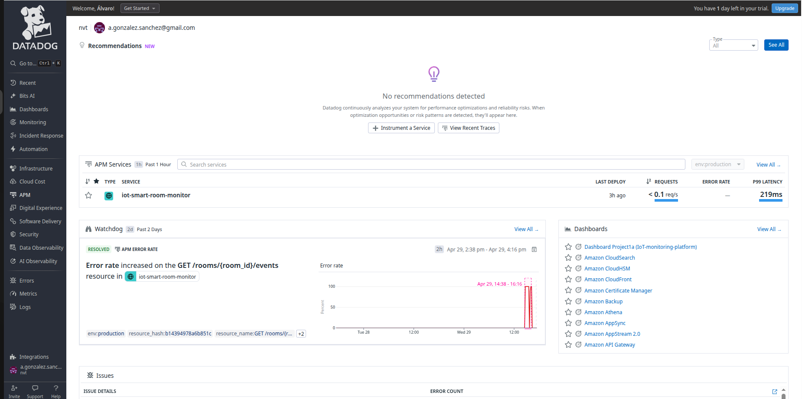
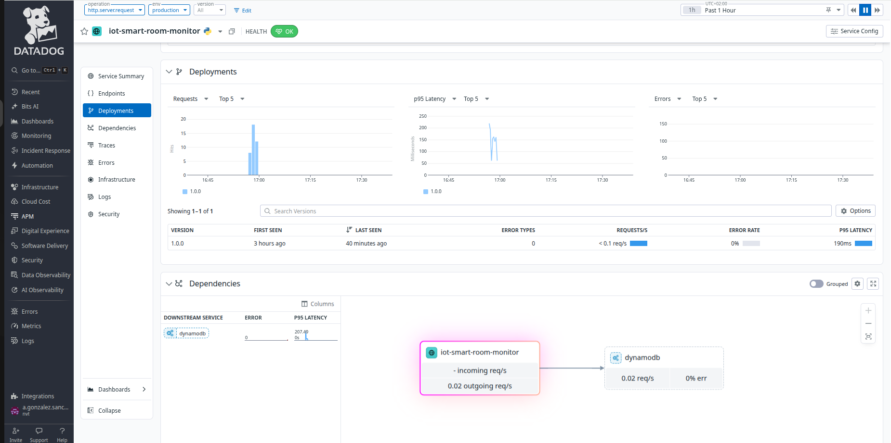
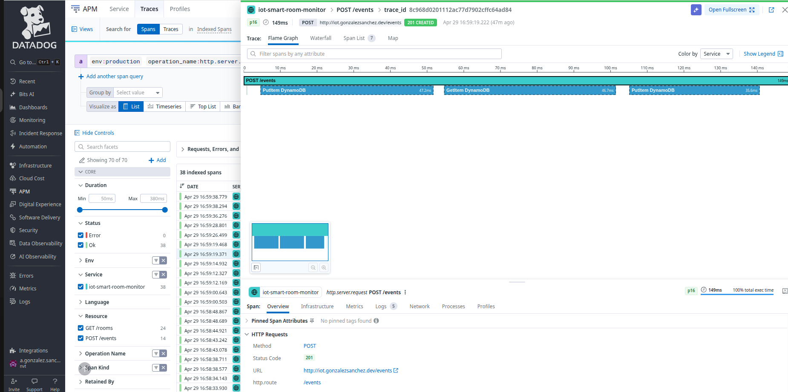
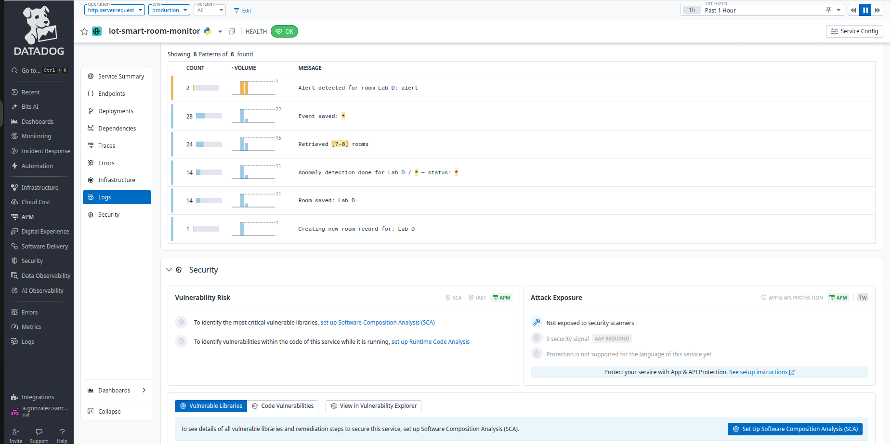
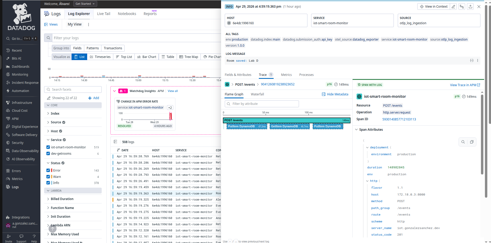

# IoT Monitoring Platform

Portfolio project demonstrating backend engineering skills in an IoT context.

The platform ingests sensor data from conference rooms (temperature, humidity, occupancy, motion), runs anomaly detection, and tracks room state in real time.

**Live demo:** [iot.gonzalezsanchez.dev](https://iot.gonzalezsanchez.dev)
**API docs:** [iot.gonzalezsanchez.dev/docs](https://iot.gonzalezsanchez.dev/docs)
**Developer:** Álvaro González Sánchez — [gonzalezsanchez.dev](https://gonzalezsanchez.dev) | [LinkedIn](https://www.linkedin.com/in/GonzalezSanchez)

---

## Architecture

```
IoT Sensor / API Client
        │
        ▼
 API Gateway (REST)
        │
   ┌────┴────────────────┐
   │                     │
   ▼                     ▼
POST /events          GET /rooms
(ingest_event)        (get_rooms / get_room_detail)
   │                     │
   ▼                     ▼
EventService         RoomRepository
   │
   ├── AnomalyDetector (threshold checks)
   ├── EventRepository (DynamoDB)
   └── RoomRepository  (DynamoDB — state update)

DynamoDB
├── SensorEvents  (room_id + timestamp)
└── RoomStatus    (room_id)
```

---

## Platform Architecture

A real IoT system has three distinct layers. This platform covers all three:

| Layer | Responsibility | Project |
|-------|---------------|---------|
| **Device layer** | How devices authenticate and send data securely | Project 3 |
| **Ingestion layer** | How sensor events are processed and stored | Project 1 / 1b |
| **Analytics layer** | What patterns emerge from the data over time | Project 2a / 2b |

Projects 1 and 2 are each implemented twice — deliberately — to demonstrate that the same business logic can be solved with different infrastructure choices.

---

## Projects

### Project 1 — Smart Room Monitor (AWS Lambda + API Gateway)

Serverless REST API deployed to AWS. Sensor events are ingested via API Gateway,
processed through anomaly detection, and stored in DynamoDB.

**Stack:** Python, AWS Lambda, API Gateway, DynamoDB, CloudFormation, CloudWatch
**Infrastructure:** Provisioned via CloudFormation (tables + IAM — least-privilege)
**CI/CD:** GitHub Actions — tests on every push, deploy to AWS on merge to main
**Tests:** 108 unit tests, 82% coverage (pytest + moto for DynamoDB mocking)
**Auth:** Intentionally excluded — device authentication (JWT via Cognito) is covered in Project 3

[View project](backend/project1a-smart-room-monitor/)

---

### Project 1b — Smart Room Monitor (FastAPI + Docker)

Same domain logic as Project 1, re-implemented with FastAPI and deployed as a
containerised application. A deliberate choice to show infrastructure independence.

**Stack:** Python, FastAPI, DynamoDB (AWS), Docker, nginx, OpenTelemetry, Datadog, Cloudflare tunnel
**Live:** [iot.gonzalezsanchez.dev](https://iot.gonzalezsanchez.dev)
**API docs:** [iot.gonzalezsanchez.dev/docs](https://iot.gonzalezsanchez.dev/docs)
**Auth:** Intentionally excluded — device authentication (JWT via Cognito) is covered in Project 3
**Observability:** End-to-end with OpenTelemetry auto-instrumentation → OTel Collector → Datadog APM — see [Observability section](#observability-project-1b) below

[View project](backend/project1b-smart-room-monitor-fastapi/)

---

### Project 2a — Behavior Pattern Analyzer (AWS native)

ETL pipeline that reads historical sensor data from Project 1a (DynamoDB) and detects
behavioral patterns across rooms over time — occupancy schedules, temperature trends,
unusual activity. Scheduled batch processing via EventBridge + Step Functions, results
stored in Aurora Serverless v2 and exposed via REST API.

**Stack:** Python 3.13, AWS Lambda, Step Functions, EventBridge, Aurora Serverless v2, Terraform, Docker
**Infrastructure:** Provisioned via Terraform (VPC, Aurora, IAM, Secrets Manager)
**CI:** GitHub Actions — mypy, ruff, pytest (unit + integration + regression), terraform validate
**Deploy:** On-demand for demos — destroyed after to minimise costs
**Tests:** Unit (mocked AWS), integration (real PostgreSQL via Docker), regression (documented production bugs)

[View project](backend/project2a-behavior-analyzer/)

---

### Project 2b — Behavior Pattern Analyzer (Data Engineering stack) *(planned)*

Same analytics goal as Project 2a, re-implemented with a data engineering stack.
A deliberate choice to demonstrate the same problem solved with different tools.

**Stack:** Python, Apache Airflow, PySpark, RDS PostgreSQL, Power BI
**CI/CD:** GitHub Actions (CI) + Jenkins (CD) — deployment pipeline with environment promotion (dev → staging → prod)

---

### Project 3 — IoT Device Gateway Simulator *(planned)*

Secure gateway for IoT device registration, authentication (JWT via Cognito), and
rate limiting. Simulates how a production IoT platform manages devices — registration,
command & control, reliable message delivery via SQS, and device status monitoring.

**Stack:** Python, AWS API Gateway, Lambda, Cognito, DynamoDB, SQS, Docker

---

### Frontend — React Dashboard

Real-time dashboard for visualising sensor data and room states.

**Stack:** React, TanStack Query, Vite, nginx
**Live:** [iot.gonzalezsanchez.dev](https://iot.gonzalezsanchez.dev)

---

## Observability (Project 1b)

End-to-end observability implemented with **zero manual instrumentation** — OpenTelemetry auto-instrumentation exports traces, logs and metrics through an OTel Collector into Datadog APM.

**What's instrumented automatically:**
- Distributed traces: every HTTP request becomes a trace with DynamoDB child spans
- Log-trace correlation: every log entry carries a `trace_id` and `span_id`
- Watchdog anomaly detection: Datadog auto-detected and resolved an error rate spike
- Metrics: `http.server.active_requests` submitted via `opentelemetry.instrumentation.fastapi`

**LinkedIn post:** [Zero manual instrumentation — OTel + Datadog on a live FastAPI service](https://www.linkedin.com/posts/activity-7455558039853645824-reu9)

---

### APM Services — Watchdog auto-detected an error rate spike on GET /rooms/{room_id}/events

> Distributed tracing pinpointed the fault to FastAPI (98.1% error), not DynamoDB (0% error) — see [LinkedIn post](https://www.linkedin.com/posts/activity-7455558039853645824-reu9) for the full trace analysis.



---

### Service map — `iot-smart-room-monitor → dynamodb` dependency auto-detected from traces



---

### Flame graph — POST /events (149ms) with 3 automatic DynamoDB child spans



---

### Log patterns — business logic visible in Datadog: anomaly detection, room state, event ingestion



---

### Log-trace correlation — flame graph embedded directly from a log entry



---

## Skills Demonstrated

| Skill | Where |
|-------|-------|
| Python clean architecture (models → services → repositories) | project 1, 1b |
| RESTful API design | project 1 (Lambda handlers), 1b (FastAPI) |
| AWS serverless (Lambda, API Gateway, CloudWatch) | project 1 |
| DynamoDB data modelling | project 1, 1b |
| Infrastructure as Code (CloudFormation) | project 1, 1b |
| Infrastructure as Code (Terraform) | project 2a |
| Docker + multi-stage builds + nginx | project 1b, frontend |
| CI/CD with GitHub Actions | project 1, 1b |
| Pydantic v2 models + validation | project 1, 1b |
| Anomaly detection logic | project 1, 1b |
| pytest + moto (DynamoDB mocking), 82% coverage | project 1 |
| mypy + pre-commit hooks | project 1, 1b |
| Cloudflare tunnel + production deployment | project 1b |
| OpenTelemetry auto-instrumentation (traces, logs, metrics) | project 1b |
| Datadog APM (distributed traces, Watchdog, log-trace correlation) | project 1b |

---

## Repository Structure

```
iot-monitoring-platform/
├── backend/
│   ├── project1a-smart-room-monitor/          # AWS Lambda + API Gateway (live)
│   ├── project1b-smart-room-monitor-fastapi/ # FastAPI + Docker (live)
│   ├── project2a-behavior-analyzer/          # AWS native ETL pipeline (planned)
│   ├── project2b-behavior-analyzer/          # Airflow + PySpark (planned)
│   └── project3-iot-gateway/                 # Device gateway (planned)
├── docs/                                      # Project specs and architecture
├── frontend/                                  # React dashboard
├── docker-compose.prod.yml                    # Production deployment
└── .github/workflows/                         # CI + deploy pipelines
```

---

## Running Locally

```bash
# Backend (FastAPI)
cd backend/project1b-smart-room-monitor-fastapi
cp .env.example .env        # fill in your AWS credentials
pip install -r requirements.txt
uvicorn main:app --reload

# Frontend
cd frontend
npm install
npm run dev
```

---

© 2026 Álvaro González Sánchez. All rights reserved.
