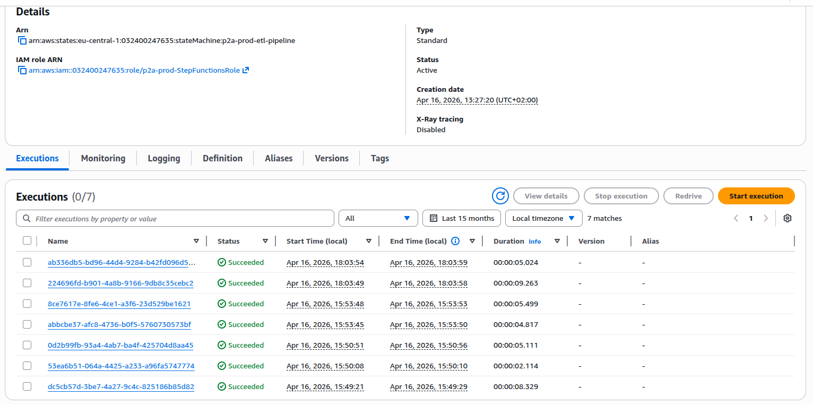
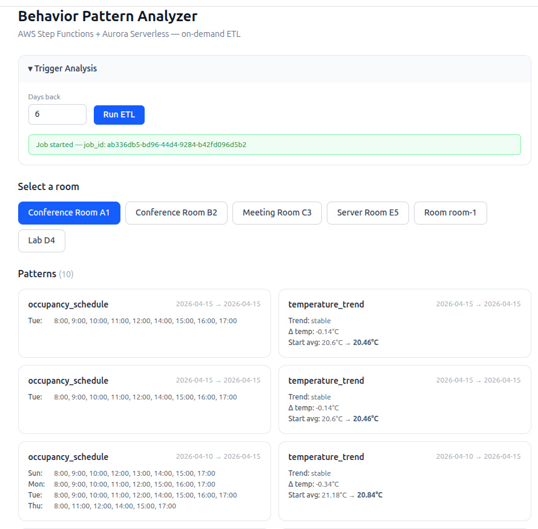

# Project 2a — Behavior Pattern Analyzer (AWS native)

## Description

ETL pipeline that reads historical sensor data from project 1a (DynamoDB), detects behavior patterns and anomalies per room, and stores the results in Aurora PostgreSQL. Results are queryable via a REST API.

## Deployment

Deployed on-demand for demos — infrastructure is destroyed after each session to minimise AWS costs (Aurora Serverless v2 has a minimum cost even when idle).

To deploy: `cd infrastructure && terraform apply`
To destroy: `cd infrastructure && terraform destroy`

## Tech Stack

- **Runtime:** Python 3.13
- **Cloud Services:** AWS Lambda, Step Functions, EventBridge, Aurora Serverless v2 (PostgreSQL), Secrets Manager, API Gateway
- **Database:** Aurora Serverless v2 (PostgreSQL — scales to zero when idle)
- **IaC:** Terraform
- **Containerization:** Docker (local development + CI)
- **Testing:** pytest (unit, integration, regression)
- **CI/CD:** GitHub Actions

## Features

- ETL pipeline: Extract (DynamoDB → Aurora) → Transform (validation + normalization) → Analyze (pattern + anomaly detection)
- Pattern detection: `occupancy_schedule`, `temperature_trend`
- Anomaly detection: `temperature` (z ≥ 3σ → medium, z ≥ 5σ → high, population stddev), `unusual_activity` (motion outside typical occupancy hours, medium)
- Scheduled batch processing via EventBridge + Step Functions
- REST API for retrieving results per entity

## API Endpoints

### POST /analyze/patterns
Start a new ETL job for a time window.

**Request:**
```json
{
  "days_back": 7
}
```

`days_back` is optional (default: 7).

**Response (202):**
```json
{
  "job_id": "550e8400-e29b-41d4-a716-446655440000",
  "execution_arn": "arn:aws:states:eu-central-1:123456789:execution:..."
}
```

---

### GET /analyze/patterns/{job_id}
Retrieve all detected patterns for a specific job.

**Response (200):**
```json
{
  "job_id": "550e8400-...",
  "patterns": [
    {
      "job_id": "550e8400-...",
      "entity_type": "room",
      "entity_id": "conference-a1",
      "pattern_type": "occupancy_schedule",
      "data": { "typical_hours": { "Monday": [9, 17] } },
      "period_start": "2026-01-06T00:00:00Z",
      "period_end": "2026-01-13T00:00:00Z"
    }
  ]
}
```

---

### GET /insights/{entity_type}/{entity_id}
Retrieve all patterns and anomalies for a single entity (room or device).

**Response (200):**
```json
{
  "entity_type": "room",
  "entity_id": "conference-a1",
  "patterns": [
    {
      "job_id": "...",
      "entity_type": "room",
      "entity_id": "conference-a1",
      "pattern_type": "occupancy_schedule",
      "data": { ... },
      "period_start": "2026-01-06T00:00:00Z",
      "period_end": "2026-01-13T00:00:00Z"
    }
  ],
  "anomalies": [
    {
      "job_id": "...",
      "entity_type": "room",
      "entity_id": "conference-a1",
      "anomaly_type": "temperature",
      "detected_at": "2026-01-10T14:00:00Z",
      "severity": "high",
      "data": { "temperature": 38.2, "mean": 22.1, "stddev": 1.8, "z_score": 5.2 }
    }
  ]
}
```

## Database Schema (Aurora PostgreSQL)

**Table:** `rooms` *(static reference table — populated via `seed_rooms.py`)*
```sql
CREATE TABLE rooms (
    room_id       TEXT             PRIMARY KEY,
    building_id   TEXT             NOT NULL,
    building_name TEXT             NOT NULL,
    floor         INTEGER,
    lat           DOUBLE PRECISION NOT NULL,
    lon           DOUBLE PRECISION NOT NULL
);
```

**Table:** `raw_sensor_data`
```sql
CREATE TABLE raw_sensor_data (
    id          BIGSERIAL    PRIMARY KEY,
    event_id    TEXT         NOT NULL UNIQUE,
    device_id   TEXT         NOT NULL,
    room_id     TEXT         NOT NULL,
    ts          TIMESTAMPTZ  NOT NULL,
    temperature DOUBLE PRECISION,
    humidity    DOUBLE PRECISION,
    motion      BOOLEAN,
    occupancy   BOOLEAN,
    raw_payload JSONB        NOT NULL,
    ingested_at TIMESTAMPTZ  NOT NULL DEFAULT NOW()
);
```

**Table:** `patterns`
```sql
CREATE TABLE patterns (
    id           BIGSERIAL   PRIMARY KEY,
    job_id       TEXT        NOT NULL,
    entity_type  TEXT        NOT NULL,  -- 'room' | 'device'
    entity_id    TEXT        NOT NULL,
    pattern_type TEXT        NOT NULL,  -- 'occupancy_schedule' | 'temperature_trend'
    period_start TIMESTAMPTZ NOT NULL,
    period_end   TIMESTAMPTZ NOT NULL,
    data         JSONB       NOT NULL,
    created_at   TIMESTAMPTZ NOT NULL DEFAULT NOW()
);
```

**Table:** `anomalies`
```sql
CREATE TABLE anomalies (
    id           BIGSERIAL   PRIMARY KEY,
    job_id       TEXT        NOT NULL,
    entity_type  TEXT        NOT NULL,  -- 'room' | 'device'
    entity_id    TEXT        NOT NULL,
    anomaly_type TEXT        NOT NULL,  -- 'temperature' | 'unusual_activity'
    detected_at  TIMESTAMPTZ NOT NULL,
    severity     TEXT        NOT NULL,  -- 'medium' | 'high'
    data         JSONB       NOT NULL,
    created_at   TIMESTAMPTZ NOT NULL DEFAULT NOW()
);
```

## Architecture

```
EventBridge (Scheduled) ──► Step Functions
                                  │
                    ┌─────────────┼─────────────┐
                    ▼             ▼             ▼
             Lambda (Extract) → Lambda (Transform) → Lambda (Analyze)
                    │                                      │
                    ▼                                      ▼
             DynamoDB                              Aurora PostgreSQL
             (project 1a)                         (patterns, anomalies)

API Gateway ──► Lambda (POST /analyze/patterns)  → Step Functions (start execution)
            ──► Lambda (GET  /analyze/patterns/{job_id}) → Aurora PostgreSQL
            ──► Lambda (GET  /insights/{entity_type}/{entity_id}) → Aurora PostgreSQL
```

**ETL steps:**

1. **Extract** — reads SensorEvents from DynamoDB (project 1a) for the given time window, writes to `raw_sensor_data`
2. **Transform** — validates and normalizes the raw data (deduplication, type casting)
3. **Analyze** — detects patterns and anomalies per room, writes to `patterns` and `anomalies`

## Screenshots

### Execution history — 7 runs, all Succeeded



### Behavior Pattern Analyzer dashboard — occupancy schedules and temperature trends per room



## Security

Intentionally excluded from this project — see [Project 3: IoT Device Gateway](../../docs/project3-iot-gateway.md) for authentication with JWT via Cognito.

Aurora credentials are managed via AWS Secrets Manager (production) or `.env` (local).

## Installation & Usage

```bash
cd backend/project2a-behavior-analyzer

# Set up local database (PostgreSQL via Docker)
docker-compose up -d db

# Run database migrations
python scripts/migrate.py

# Seed rooms with buildings and coordinates
python scripts/seed_rooms.py

# Deploy to AWS (Terraform)
cd infrastructure
terraform init
terraform apply

# Manually start an analysis
curl -X POST https://<api-gateway-url>/analyze/patterns \
  -H "Content-Type: application/json" \
  -d '{"days_back": 7}'
```

## Testing

```bash
# Unit tests (mocked AWS + DB)
pytest tests/unit/

# Integration tests (requires local PostgreSQL)
pytest tests/integration/

# Regression tests
pytest tests/regression/

# Coverage
pytest --cov=lambdas tests/
```
