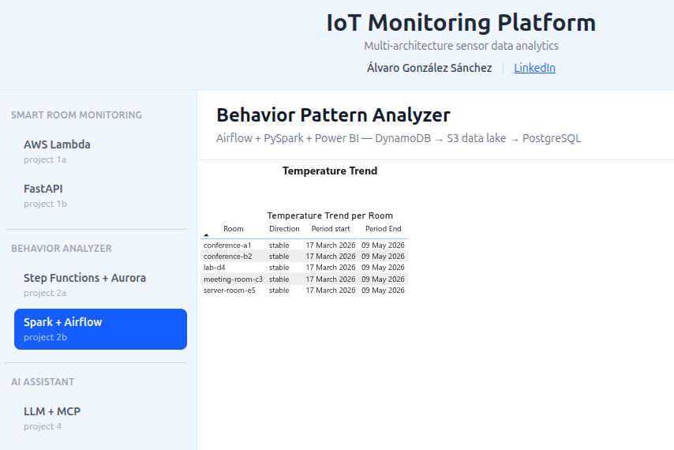
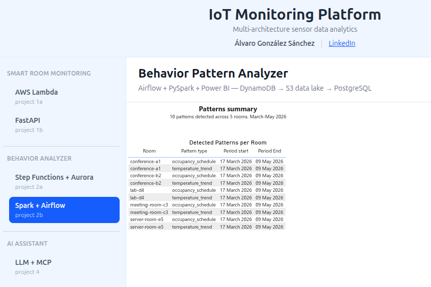

# Project 2b — Behavior Pattern Analyzer (Data Engineering stack)

## Beschrijving

ETL pipeline die sensor data uit project 1a (DynamoDB) extraheert, transformeert en analyseert via PySpark. Detecteert gedragspatronen en anomalieën per kamer en schrijft resultaten naar PostgreSQL. Gevisualiseerd in Power BI.

Zelfde analytisch doel als project 2a — bewust opnieuw geïmplementeerd met een Data Engineering stack om het contrast te tonen: AWS native (Lambda + Step Functions) vs. PySpark + Airflow.

## Stack

- **Processing:** PySpark 4.x (Spark SQL, window functions, `regr_slope`)
- **Spatial analysis:** GeoPandas + Shapely (anomalie hotspots per gebouw, WGS84 coördinaten)
- **Reporting layer:** dbt (staging views + marts voor Power BI)
- **Orchestration:** Apache Airflow 2.x (DAG met BashOperators)
- **Storage:** AWS S3 (data lake — raw + processed Parquet), PostgreSQL (resultaten)
- **Visualization:** Power BI (direct connect op PostgreSQL — map visual, bar charts, heatmap)
- **Observability:** OpenTelemetry (custom job metrics + Airflow StatsD) → OTel Collector → Grafana Cloud (Mimir metrics + Loki logs), postgres-exporter voor PostgreSQL metrics
- **IaC:** Terraform (S3 bucket + IAM)
- **CI/CD:** GitHub Actions (CI) + Jenkins (CD)
- **Testing:** pytest + PySpark in-process

## Data Lake Architecture

Drie lagen op S3 (Medallion architecture):

```
DynamoDB (prod-SensorEvents)
    │
    ▼  jobs/extract.py  (spark-submit)
S3/raw        ← Bronze: ruwe Parquet, gepartitioneerd per jaar/maand
    │
    ▼  jobs/transform.py  (spark-submit)
S3/processed  ← Silver: gevalideerd en opgeschoond Parquet
    │
    ▼  jobs/analyze.py  (spark-submit)
PostgreSQL    ← Gold: patronen + anomalieën (voor Power BI)
    │
    ▼  jobs/spatial.py  (GeoPandas)
PostgreSQL    ← Spatial: anomalie hotspots per gebouw (voor Power BI map visual)
    │
    ▼  dbt run  (dbt-postgres)
PostgreSQL    ← Marts: anomaly_detail, pattern_detail, building_summary (Power BI-klare tabellen)
```

Idempotent: `partitionOverwriteMode=dynamic` — re-runnen overschrijft alleen de betreffende maandpartities.

## Design Decisions

**Bronze laag bevat genormaliseerd Parquet, niet ruwe JSON**

In een strikte Medallion architectuur zou Bronze de DynamoDB items bewaren als ruwe JSON — exact zoals de bron ze levert. Hier schrijft `extract.py` al als Parquet naar Bronze, na een lichte normalisatie van twee event formaten (project 2b seed format + project 1b API format) naar één unified schema.

Trade-off: Parquet is gecomprimeerd en efficiënt leesbaar door Spark. Ruwe JSON in Bronze zou volledige herverwerking toelaten bij een bug in de extractie — dat is hier niet mogelijk. Voor een portfolio met beperkte dataset is dit aanvaardbaar; in productie zou ik Bronze als ruwe JSON bewaren.

**Gold laag in PostgreSQL, niet op S3**

`analyze.py` schrijft patronen en anomalieën naar PostgreSQL via JDBC in plaats van naar S3 Gold. Reden: Power BI verbindt eenvoudiger met een SQL database dan met S3 + Athena. In een volledig AWS-native setup zou Gold als Parquet op S3 staan en Athena de query-laag vormen.

## Airflow DAG

`dags/behavior_pipeline.py` — wekelijks elke maandag om 02:00:

```
manage_partitions >> extract >> transform >> analyze >> spatial >> dbt_run
```

- `on_failure_callback` logt een `[ALERT]` na alle retries uitgeput
- `SPARK_MASTER` configureerbaar via env var (default: `local[*]`)

## Features

- Occupancy schedule detectie — gemiddelde bezettingsgraad per (kamer, dag, uur) via window aggregatie
- Temperature trend — stijgend/dalend/stabiel via `regr_slope` (lineaire regressie)
- Anomalie detectie — z-score per kamer (populatie stddev); z ≥ 3 → medium, z ≥ 5 → high
- Occupancy anomalie detectie — kamer bezet tijdens typisch lege uren (occupancy_rate < 20%) → unusual_activity (medium)
- Spatiale analyse — GeoPandas aggregeert anomalieën per gebouw (lat/lon), schrijft naar `spatial_insights` voor Power BI map visual
- dbt rapportagelaag — staging views + gematerialiseerde marts (`anomaly_detail`, `pattern_detail`, `building_summary`) met source tests
- Observability — OTel counters per pipeline stap, Airflow StatsD metrics, PostgreSQL metrics via postgres-exporter → Grafana Cloud

**Note:** de spatiale analyse (`jobs/spatial.py`) is specifiek voor project 2b. Project 2a exposeert resultaten via een REST API; Power BI kan daar rechtstreeks de `rooms` tabel voor gebruiken. GeoPandas past in de Data Engineering stack van project 2b (Python jobs pipeline), niet in de AWS Lambda architectuur van 2a.

## Database Schema (PostgreSQL)

**Table:** `rooms` *(statische referentietabel — gevuld via `seed_rooms.py`)*
```sql
CREATE TABLE rooms (
    room_id       TEXT             PRIMARY KEY,
    building_id   TEXT             NOT NULL,
    building_name TEXT             NOT NULL,
    floor         INTEGER,
    lat           DOUBLE PRECISION NOT NULL,
    lon           DOUBLE PRECISION NOT NULL
);
```

**Table:** `patterns`
```sql
CREATE TABLE patterns (
    id           BIGSERIAL   PRIMARY KEY,
    job_id       TEXT        NOT NULL,
    entity_type  TEXT        NOT NULL,
    entity_id    TEXT        NOT NULL,
    pattern_type TEXT        NOT NULL,
    period_start TIMESTAMPTZ NOT NULL,
    period_end   TIMESTAMPTZ NOT NULL,
    data         JSONB       NOT NULL,
    created_at   TIMESTAMPTZ NOT NULL DEFAULT NOW()
);
```

**Table:** `anomalies`
```sql
CREATE TABLE anomalies (
    id           BIGSERIAL   PRIMARY KEY,
    job_id       TEXT        NOT NULL,
    entity_type  TEXT        NOT NULL,
    entity_id    TEXT        NOT NULL,
    anomaly_type TEXT        NOT NULL,
    detected_at  TIMESTAMPTZ NOT NULL,
    severity     TEXT        NOT NULL,
    data         JSONB       NOT NULL,
    created_at   TIMESTAMPTZ NOT NULL DEFAULT NOW()
);
```

**Table:** `spatial_insights` *(geschreven door `jobs/spatial.py`)*
```sql
CREATE TABLE spatial_insights (
    id            BIGSERIAL        PRIMARY KEY,
    job_id        TEXT             NOT NULL,
    building_id   TEXT             NOT NULL,
    building_name TEXT             NOT NULL,
    lat           DOUBLE PRECISION NOT NULL,
    lon           DOUBLE PRECISION NOT NULL,
    anomaly_count INTEGER          NOT NULL,
    high_count    INTEGER          NOT NULL,
    medium_count  INTEGER          NOT NULL,
    dominant_type TEXT,
    period_start  TIMESTAMPTZ      NOT NULL,
    period_end    TIMESTAMPTZ      NOT NULL,
    created_at    TIMESTAMPTZ      NOT NULL DEFAULT NOW()
);
```

## dbt Rapportagelaag

`dbt run` materialiseert staging views en marts rechtstreeks in PostgreSQL — klaar voor Power BI DirectQuery.

### Modellen

**Staging** (views — geen extra opslag):

| Model | Bron | Transformatie |
|---|---|---|
| `stg_anomalies` | `anomalies` tabel | `entity_id` hernoemd naar `room_id` |
| `stg_patterns` | `patterns` tabel | `entity_id` hernoemd naar `room_id` |
| `stg_rooms` | `rooms` tabel | Geen transformatie |

**Marts** (gematerialiseerde tabellen — Power BI-klaar):

**`anomaly_detail`** — anomalies gejoined met rooms, inclusief tijdextracties:
```sql
room_id | building_id | building_name | lat | lon | anomaly_type | severity | detected_at | detected_hour | detected_dow
```

**`pattern_detail`** — patterns gejoined met rooms:
```sql
room_id | building_id | building_name | pattern_type | period_start | period_end
```

**`building_summary`** — aggregatie per gebouw over alle jobs:
```sql
building_id | building_name | lat | lon | anomaly_count | high_count | medium_count | dominant_type | last_anomaly_at
```

### Source tests (`dbt test`)

| Test | Kolom |
|---|---|
| unique + not_null | `anomalies.id`, `rooms.room_id` |
| accepted_values | `anomalies.anomaly_type` → [temperature, unusual_activity] |
| accepted_values | `anomalies.severity` → [medium, high] |
| accepted_values | `patterns.pattern_type` → [occupancy_schedule, temperature_trend] |

### Verschil met `spatial_insights`

| | `spatial_insights` | `building_summary` (dbt) |
|---|---|---|
| **Geschreven door** | `jobs/spatial.py` (GeoPandas) | dbt mart |
| **Scope** | Per job (job_id aanwezig) | Alle jobs gecumuleerd |
| **Doel** | Power BI map visual (bubble per gebouw per run) | Overzicht over alle runs heen |

## Power BI Dashboard

### Temperature Trend per room — linear regression slope via PySpark regr_slope



### Patterns Summary — occupancy schedule and temperature trend per room



## Observability

**Architectuur:** OTel Collector ontvangt metrics van drie bronnen en stuurt naar Grafana Cloud.

```
Airflow (StatsD)  ──►┐
jobs/*.py (OTLP)  ──►│  OTel Collector  ──►  Grafana Cloud (Mimir + Loki)
postgres-exporter ──►┘
```

**Airflow StatsD** — DAG run duration, task success/failure, retry counts per taak.

**Custom job metrics** (OTel counters via `jobs/metrics.py`):

| Metric | Job |
|---|---|
| `p2b.extract.records_scanned` | DynamoDB items gelezen |
| `p2b.extract.records_written` | Records geschreven naar S3/raw |
| `p2b.transform.records_raw` | Raw records gelezen |
| `p2b.transform.records_processed` | Valide records naar S3/processed |
| `p2b.transform.records_dropped` | Gefilterde records (null, out-of-range) |
| `p2b.analyze.anomalies_detected` | Totaal anomalieën per run |
| `p2b.analyze.patterns_detected` | Totaal patronen per run |
| `p2b.spatial.buildings_processed` | Gebouwen in spatial_insights |

**PostgreSQL metrics** — `postgres-exporter` container scrapt query latency, connections, table sizes via Prometheus endpoint → OTel Collector.

`jobs/metrics.py` is een no-op als `OTEL_EXPORTER_OTLP_ENDPOINT` niet gezet is — jobs draaien gewoon zonder metrics in lokale dev omgeving.

## Installatie & Gebruik

```bash
cd backend/project2b-behavior-analyzer

# Lokale database opzetten (PostgreSQL via Docker)
docker-compose -f docker/docker-compose.yml up -d postgres

# Database migraties uitvoeren
python scripts/migrate.py

# Kamers seeden met gebouwen en coördinaten
python scripts/seed_rooms.py

# Handmatig een job starten (vereist .env met AWS + DB credentials)
spark-submit --master local[*] jobs/extract.py
spark-submit --master local[*] jobs/transform.py
spark-submit --master local[*] jobs/analyze.py
python jobs/spatial.py
```

Zie `.env.example` voor de vereiste environment variabelen.

## Testing

```bash
# Virtual environment activeren
source .venv/bin/activate

# Unit tests
pytest tests/unit/

# Coverage rapport
pytest tests/unit/ --cov=jobs --cov=dags --cov-report=term-missing
```

### Coverage aanpak

`pragma: no cover` staat **alleen** op functies die echte infrastructuur vereisen om te draaien:

| Functie | Reden |
|---|---|
| `scan_dynamodb` | Vereist echte DynamoDB verbinding |
| `write_parquet` | Vereist echte S3 verbinding |
| `read_raw`, `read_processed` | Vereist echte S3 verbinding |
| `write_patterns`, `write_anomalies` | Vereist echte PostgreSQL + JDBC |
| `build_spark` | Vereist een Spark cluster |

Pipeline orchestratie (`main()` in alle drie jobs) heeft **geen** `pragma: no cover` — dat wordt getest via mocks.

Toekomstige uitbreiding: integratie tests via LocalStack (S3 mock) + lokale PostgreSQL om de I/O functies ook te dekken.
