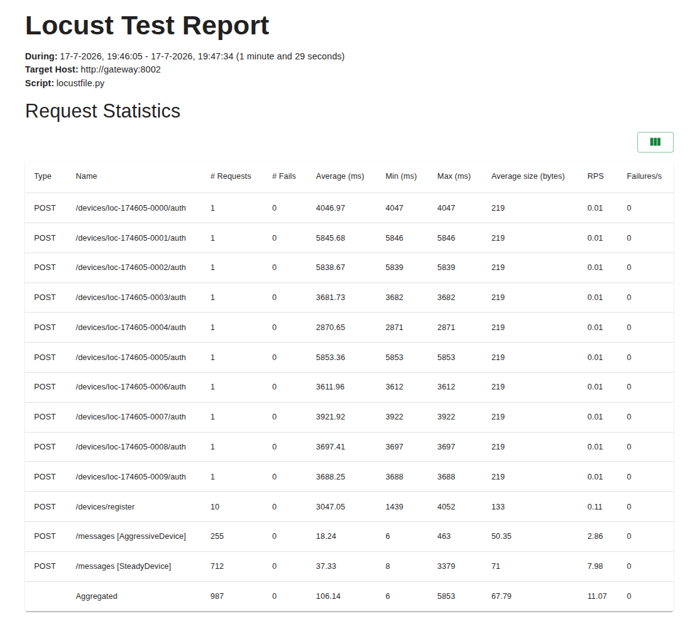

# Project 3b — IoT Device Gateway (FastAPI + Kafka)

Secure gateway for IoT device registration, authentication, and message
delivery — the device layer of the platform. Physical sensors are simulated;
everything they would do (register once, exchange an API key for a short-lived
JWT, send readings) runs against a real gateway with real security controls,
and their data flows through Kafka into the same DynamoDB tables the rest of
the platform reads.

Project 3 is designed in two variants (same security concept, different
infrastructure): **3a** AWS-native (Cognito, API Gateway, SQS — [specced
only](../../docs/project3a-iot-gateway.md)) and **3b** self-hosted (this
implementation). Full spec: [docs/project3b-iot-gateway.md](../../docs/project3b-iot-gateway.md) ·
build contract: [docs/project3-prd.md](../../docs/project3-prd.md).

## Architecture

```
simulate_device.py (N devices)
        │  API key → JWT
        ▼
Gateway (FastAPI, async) — auth, validation, rate limiting          :8002
        │  produce (key = device_id)
        ▼
Redpanda broker ── topic sensor-events ──► consumer (aiokafka,
        │                                  group gateway-normalizer)
        │                                        │ normalise to shared contract
        │                                        ▼
        │                                  DynamoDB prod-SensorEvents
        │                                        + prod-RoomStatus refresh
        └── topic sensor-events.dlq  ◄── records that fail normalisation
```

Gateway and broker are internal-only on the server (Docker `expose`, no
published ports). After normalisation the readings appear on the same live
dashboard that project 1b serves — one shared data contract across the platform.

## Stack

Python 3.12 · FastAPI (async) · Redpanda (Kafka API) · `aiokafka` · DynamoDB ·
bcrypt + `python-jose` (HS256) · pytest + moto + mypy · locust · CloudFormation

## Security model

- **API keys** (`p3-` + 64 hex) issued once at registration, stored only as
  bcrypt hashes
- **Short-lived JWTs** (1 hour) — every message requires a Bearer token whose
  subject matches the `device_id` (403 on mismatch)
- **Per-device rate limiting** — sliding window per minute, limits per device
  type in [`config/rate_limits.yml`](config/rate_limits.yml), 429 when exceeded
  (in-memory: documented single-instance limitation)
- **Fail closed** — broker unavailable → 503; no `JWT_SECRET` → the gateway
  refuses to start
- **Least-privilege IAM** — the gateway user can only touch the Devices table,
  the consumer user only the contract tables
  (see [infrastructure/README.md](infrastructure/README.md))

## Data contract & DLQ

The consumer fans each gateway message out to one item per sensor reading in
the exact format project 1b writes (golden-tested against 1b's item shape) and
refreshes the room's current state. Writes are **idempotent by construction**
(deterministic event IDs + sort keys), so Kafka's at-least-once delivery is
safe. Anything that cannot be normalised — malformed payloads, unknown room
mappings — goes to `sensor-events.dlq` with the original message and the error
attached: never dropped, never half-written (the streaming twin of project 2c's
quarantine table).

## Run locally

```bash
cd backend/project3b-iot-gateway

# Redpanda + gateway + consumer (needs a .env — see .env.example / .env.consumer.example)
docker compose -f docker/docker-compose.yml up -d

# tests + type check
pip install -r requirements-dev.txt
pytest
mypy src

# simulate 5 devices for a minute
python scripts/simulate_device.py --gateway http://localhost:8002 \
    --devices 5 --rate 12 --duration 60
```

## Load testing (locust)

Rate limiting is only credible if you can prove it. Three scenarios in
[`loadtest/locustfile.py`](loadtest/locustfile.py):

| Scenario | Setup | Pass criterion |
|---|---|---|
| `normal` | 10 devices, 1 req/s each | everything 202, no 429s |
| `ratelimit` | 1 device at ~200 req/min | 429 once past the 60/min threshold |
| `isolation` | 1 aggressive + 9 steady devices | only the aggressor sees 429s |

```bash
locust -f loadtest/locustfile.py --host http://localhost:8002 \
    --headless -u 10 -r 10 -t 90s --tags isolation
```

A 429 on the aggressive device counts as a pass (the limiter doing its job);
a 429 on a steady device fails the run — that would be cross-device impact.

### Acceptance run (2026-07-17)

Ran against the production gateway on the server's Docker network (throwaway
`python:3.12-slim` + locust, 90s per scenario):

| Scenario | Requests | Failures | Evidence |
|---|---|---|---|
| `normal` | 731 (711 messages) | 0 | all steady traffic, 0 rate limiting |
| `ratelimit` | 274 (272 messages) | 0† | gateway access log: **120× 202 / 152× 429** past the 60/min threshold |
| `isolation` | 987 (712 steady + 255 aggressive) | 0 | steady devices: 0 failures — aggressor's 429s never touched its neighbours |

† Locust's own "0 Fails" on the `ratelimit`/aggressive stream is expected, not
misleading — a 429 there is the pass criterion by design (see docstring). The
gateway's own access log is the record that the limiter actually fired.

Kafka stayed clean under load: `sensor-events` high-watermark advanced by
~1600 messages, **zero new entries on the DLQ**.



## Deployment

Runs permanently on the home server via the root `docker-compose.prod.yml`
(three services: `redpanda`, `gateway`, `consumer` — the latter two share one
image with different commands). AWS resources (Devices table + the two IAM
users) are CloudFormation, deployed by the `deploy-project3-infra.yml` GitHub
Actions workflow — see [infrastructure/README.md](infrastructure/README.md)
for deploy, key rotation, and destroy.

## Project structure

```
project3b-iot-gateway/
├── src/
│   ├── gateway/           # FastAPI app: register/auth/messages/status/health
│   ├── consumer/          # normalizer: Kafka → shared contract + DLQ
│   └── common/            # request/response models (shared contract surface)
├── tests/                 # 36 tests — API, security, rate limiter, consumer contract
├── scripts/simulate_device.py
├── loadtest/locustfile.py
├── infrastructure/        # CloudFormation + deploy/destroy README
├── config/rate_limits.yml
└── docker/docker-compose.yml   # local Redpanda + gateway + consumer
```

## Future extensions

See the [spec's Future Extensions](../../docs/project3b-iot-gateway.md#future-extensions):
DLQ replay, DLQ alerting, room-status enrichment via a shared library, stack
drift detection.
