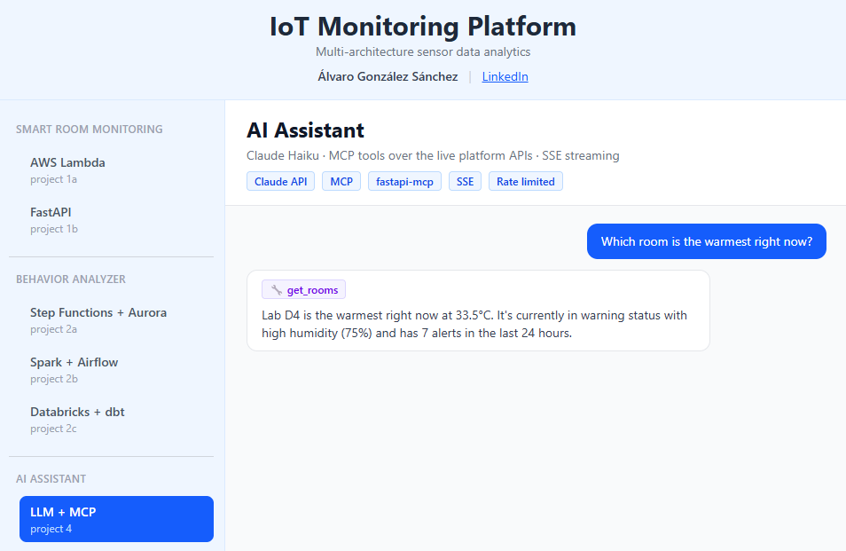

# Project 4 — AI Assistant (Claude + MCP)

Conversational AI layer over the live platform. A chat interface in the portfolio dashboard where Claude answers questions about the real sensor data — *"Which room is the warmest right now?"* — by calling the platform's own REST APIs as MCP tools.

Built in two parts:

- **4a — MCP server** (lives in [project 1b](../project1b-smart-room-monitor-fastapi/)): the existing FastAPI routes exposed as MCP tools via `fastapi-mcp`, internal-only.
- **4b — AI assistant service** (this directory): a separate FastAPI service that runs the agent loop — Claude Haiku 4.5 + tool calls over MCP + SSE token streaming to the React frontend.

Full design contract: [docs/project4-prd.md](../../docs/project4-prd.md).



## Stack

| Layer | Tool | Purpose |
|---|---|---|
| LLM | Claude Haiku 4.5 (`claude-haiku-4-5`) | Answer generation + tool selection |
| SDK | `anthropic` (async) | Streaming Messages API |
| Tool protocol | MCP (official `mcp` client, streamable HTTP) | Discover + call the 7 read-only tools on project 1b |
| API | FastAPI + SSE (`StreamingResponse`) | `POST /ai/chat` streams tokens to the browser |
| Rate limiting | slowapi, keyed on `CF-Connecting-IP` | 5 req/min, 20 req/day per visitor |
| Frontend | React (`AiDashboard.jsx`) | Chat UI with live token streaming + tool badges |
| Deployment | Docker (non-root) + nginx `/ai/` route | Own container — isolated from the ingestion API |

## Architecture

```
Browser (React chat tab)
    ↓ POST /ai/chat            — SSE: token / tool_use / done / error events
nginx (frontend container)     — proxy_buffering off for SSE
    ↓
ai-assistant container :8001   — this service
    ↓ Claude API (streaming)   — bounded agent loop, max 8 steps
    ↓ MCP (streamable HTTP)    — http://backend:8000/mcp, internal Docker network only
backend container (project 1b) — 7 read-only tools (rooms, events, lakehouse)
    ↓
DynamoDB + lakehouse Gold layer
```

**Agent loop** (`chat_service.py`): the loop is hand-written on `client.messages.stream()` rather than the SDK tool runner, because the runner does not stream tokens. Each step streams text to the client as it is generated; when Claude requests a tool, the MCP call runs and its result is fed back as a `tool_result` block. The loop is bounded (`MAX_STEPS=8`) and history is capped server-side.

**MCP session** (`mcp_client.py`): one session per instance, opened in the FastAPI lifespan against project 1b's `/mcp` endpoint. Tools are discovered at startup and translated to Anthropic `tools` schema. `/mcp` itself is never exposed outside the Docker network.

## Security & cost control

- **Least privilege**: this container gets only `ANTHROPIC_API_KEY` — no AWS or Databricks credentials. All data access goes through the read-only MCP tools.
- **Read-only by design**: the MCP allowlist contains exactly 7 GET operations; `POST /events` is deliberately excluded.
- **Rate limiting**: slowapi keyed on the `CF-Connecting-IP` header (the socket IP is the Cloudflare tunnel, so it would rate-limit everyone as one client).
- **Bounded spend**: `max_tokens=1024`, `MAX_STEPS=8`, capped history, prepaid Anthropic credits as hard spend cap.
- **No leaked internals**: SDK exceptions are mapped to generic SSE error events; the frontend renders plain text only (no HTML injection from model output).
- **Prompt hygiene**: system prompt (`brain.md`) instructs the model to always fetch live data, never invent rooms, and ignore instructions embedded in tool results.

## SSE event schema

Each frame is `data: {json}\n\n`:

| Event | Payload | Meaning |
|---|---|---|
| `token` | `content` | Next chunk of the answer text |
| `tool_use` | `name` | Claude is calling an MCP tool (shown as a badge in the UI) |
| `done` | — | Turn finished |
| `error` | `code`, `message` | Generic error (`llm_unavailable`, `step_limit_reached`, `internal_error`) |

## Local development

```bash
cd backend/project4-ai-assistant
python -m venv .venv && source .venv/bin/activate
pip install -r requirements-dev.txt

cp .env.example .env        # set ANTHROPIC_API_KEY, optionally MCP_SERVER_URL

# Run tests + type check
pytest --cov=src
mypy src/

# Run the service (needs a reachable MCP server, see below)
uvicorn main:app --app-dir src --port 8001
```

**Full local end-to-end without Docker or AWS**: run `moto` as a standalone DynamoDB (`pip install 'moto[server]'`, `moto_server -p 8001`), start project 1b against it (`AWS_ENDPOINT_URL`, dummy credentials), then point this service at it with `MCP_SERVER_URL=http://127.0.0.1:<1b-port>/mcp`.

## Testing

12 tests, 84% coverage — the agent loop, MCP client, and API are tested against fakes (no network, no API key):

| What | How | Where |
|---|---|---|
| Agent loop: text-only turn, tool round-trip (`tool_use_id` matching), history cap, step limit | Fake Anthropic stream + fake MCP client | `tests/test_chat_service.py` |
| Tool discovery (7-tool allowlist), schema translation, result extraction | Monkeypatched MCP transport | `tests/test_mcp_client.py` |
| Health endpoint, SSE content type, per-IP rate limiting (429 for one IP, 200 for another), input validation (empty / oversized → 422) | FastAPI TestClient | `tests/test_api.py` |

CI (`.github/workflows/ci.yml`, job `test-project4b`): mypy + pytest with coverage on every push.

## Configuration

| Variable | Default | Purpose |
|---|---|---|
| `ANTHROPIC_API_KEY` | — (required, fail-fast at startup) | Claude API key |
| `MCP_SERVER_URL` | `http://backend:8000/mcp` | Project 1b MCP endpoint |
| `MODEL` | `claude-haiku-4-5` | Model — upgrading is a one-line change |
| `MAX_TOKENS` | `1024` | Output cap per step |
| `RATE_LIMIT_PER_MINUTE` / `RATE_LIMIT_PER_DAY` | `5` / `20` | Per-IP limits |

Production secrets live in `.env.prod` on the server only — never committed.
