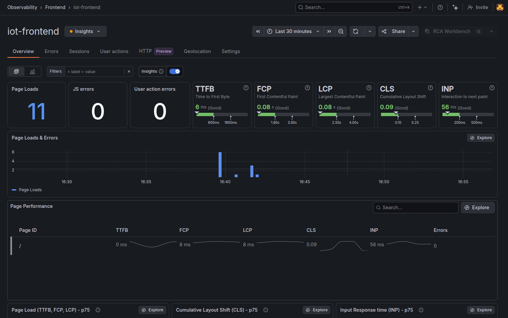

# Frontend — React Dashboard

## Overview

Real-time dashboard for visualising IoT sensor data, room states, and behavioral analytics results across all portfolio projects.

**Live:** [iot.gonzalezsanchez.dev](https://iot.gonzalezsanchez.dev)

---

## Stack

| Tool | Purpose |
|------|---------|
| React 18 | UI framework |
| Vite | Build tool and dev server |
| Tailwind CSS | Styling |
| nginx | Static file serving in production |
| Docker | Containerised deployment |

---

## Architecture

```
Browser
   │
   ▼
nginx (port 80 inside container, 3000 on host)
   │
   ▼
React SPA (built with Vite)
   │
   ├── App.jsx              — root component, page routing
   ├── components/
   │   └── ProjectTabs.jsx  — navigation sidebar (6 tabs, grouped by project)
   └── pages/
       ├── RoomDashboard.jsx        — project 1a (Lambda) én 1b (FastAPI, zelfde component)
       ├── BehaviorDashboard.jsx    — project 2a (AWS Step Functions)
       ├── PowerBIDashboard.jsx     — project 2b (Airflow + PySpark + Power BI)
       ├── LakehouseDashboard.jsx   — project 2c (Databricks + dbt)
       └── AiDashboard.jsx          — project 4 (Claude + MCP chat, SSE streaming)
```

---

## Navigation

6 tabs in a left sidebar (`ProjectTabs.jsx`):

| Tab | Project | Status |
|-----|---------|--------|
| AWS Lambda | 1a — AWS Lambda + API Gateway | Live |
| FastAPI | 1b — FastAPI + Docker | Live |
| Step Functions + Aurora | 2a — Step Functions + Aurora | NotDeployed (on-demand) |
| Spark + Airflow | 2b — Airflow + PySpark + Power BI | Live |
| Databricks + dbt | 2c — Azure Databricks + dbt | Live |
| LLM + MCP | 4 — AI Assistant (Claude + MCP) | Live |

> Note: Project 3 (IoT Gateway) has no frontend tab — it is a backend-only project.

---

## Features

**Smart Room (Lambda) + Smart Room (FastAPI):**
- Lists all rooms with current sensor state (temperature, humidity, occupancy, motion)
- Room cards colour-coded: normal (green), warning (amber), alert (red), offline (grey)
- Click a room to expand its event history
- Send Sensor Event form — POST a sensor event directly from the UI
- Auto-refreshes every 30 seconds

**Behavior Analyzer (AWS):**
- Shows detected patterns and anomalies from the Step Functions pipeline
- Displays `NotDeployed` state when AWS infrastructure is torn down (on-demand model)

**Behavior Analyzer (Spark):**
- Embedded Power BI dashboard (iframe) showing:
  - Anomaly overview per room + severity matrix
  - Temperature trend per room (rising/falling/stable)
  - Occupancy patterns per room (period_start/end)
- Public iframe URL from app.powerbi.com

**AI Assistant (project 4):**
- Chat interface over the live sensor data — Claude answers via MCP tools
- Tokens streamed live via SSE (`POST /ai/chat`, parsed with `res.body.getReader()`)
- Tool badges show which MCP tool Claude called (e.g. 🔧 get_rooms)
- Suggestion chips for first-time visitors
- Plain-text rendering only — model output is never injected as HTML
- Friendly error message on rate limit (429)

---

## Observability (Grafana Faro)

The dashboard ships with real user monitoring (RUM) via the **Grafana Faro Web SDK** (`@grafana/faro-web-sdk` + `@grafana/faro-web-tracing`), initialised once in [`src/faro.js`](../frontend/src/faro.js) before the app renders.

- Collects Web Vitals (TTFB, FCP, LCP, CLS, INP), JS errors, HTTP calls and per-session user journeys
- Sends beacons to the Grafana Cloud Frontend Observability collector; access is restricted by a domain allowlist (`iot.gonzalezsanchez.dev`), not by keeping the collect URL secret — it is public in the bundle by nature
- Initialisation is conditional on `VITE_FARO_URL`: production builds get it as a Docker build arg, local dev builds tree-shake Faro out entirely



---

## Environment Variables

| Variable | Description |
|----------|-------------|
| `VITE_API_ENDPOINT` | Project 1b FastAPI base URL |
| `VITE_P2A_API_ENDPOINT` | Project 2a API Gateway URL (commented out when AWS destroyed) |
| `VITE_AI_ENDPOINT` | Project 4 AI assistant base URL (`/ai/*` routes) |
| `VITE_FARO_URL` | Grafana Faro collect endpoint — Faro stays disabled when unset (local dev) |

Set in `.env` for local development. In production, injected at build time via GitHub Actions secrets as Docker build args.

---

## Running Locally

```bash
cd frontend
npm install
npm run dev        # starts dev server at http://localhost:5173
```

Set `VITE_API_ENDPOINT` in `.env`:
```
VITE_API_ENDPOINT=http://localhost:8000
```

---

## Deployment

Built as a static site and served via nginx inside a Docker container. Image pushed to `ghcr.io/gonzalezsanchez/iot-monitoring-platform` by GitHub Actions on every merge to main.

To update the server after a new image is pushed:
```bash
git pull origin main
docker compose -f docker-compose.prod.yml pull
docker compose -f docker-compose.prod.yml up -d --force-recreate
```

> Always run `pull` before `up --force-recreate` — the image lives on GHCR, not in git.

---

## Project Structure

```
frontend/
├── src/
│   ├── App.jsx                      — root component, page routing
│   ├── index.jsx                    — entry point
│   ├── components/
│   │   └── ProjectTabs.jsx          — navigation sidebar (6 tabs, grouped labels)
│   └── pages/
│       ├── RoomDashboard.jsx        — project 1a (Lambda) én 1b (FastAPI)
│       ├── BehaviorDashboard.jsx    — project 2a (AWS)
│       ├── PowerBIDashboard.jsx     — project 2b (Power BI iframe)
│       ├── LakehouseDashboard.jsx   — project 2c (Databricks + dbt)
│       └── AiDashboard.jsx          — project 4 (Claude + MCP chat)
├── Dockerfile                       — multi-stage build (node → nginx)
├── nginx.conf                       — nginx config for SPA routing
├── package.json
└── vite.config.js
```
